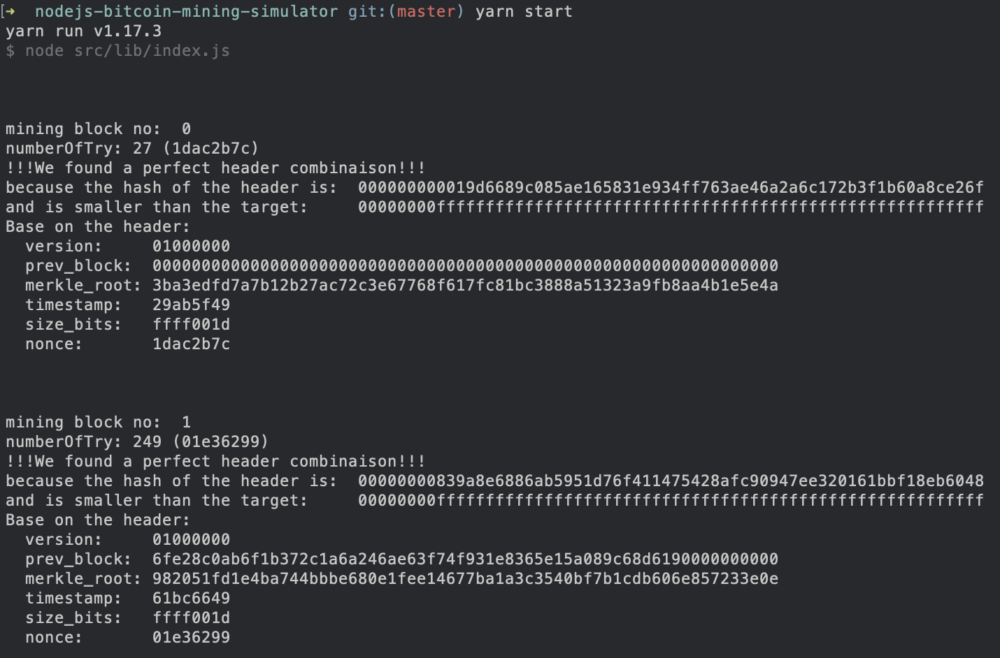

# Bitcoin Mining Genesis Block in NodeJs
A NodeJs implementation of the Bitcoin mining algorithm

This small script is a pseudo-simulation of the Bitcoin block mining process.

The algorithm of bitcoin mining is double-hashes header with SHA-256 and attempts to find a hash less than the target.

Please note for the academic purpose, all the variables header is took from the already mined block. See folder [json-header-blocks](./json-header-blocks/). for each json header block file, it take the content and try to find the hash of the header. If the hash satisfy the comparison value (less than the target). We find a valid block.

The header of each block is composed of 6 variables: **version, prevBlockHash, merkleRoot, timestamp, bits, nonce** The fixed variable for each miners during the mining block period window (10 min) is:  **version, prevBlockHash, bits**. The other 3 variables can change between miners while mining is: **merkleRoot, timestamp, nonce**. So keep in mind the simulator not reflect the reality because in only the **nonce** is changing because it's easier to understand, easier to find and enable to find the same parameter of the correct mining existed block.

Because we want to simulate the mining process by fallowing the blockchain, only the nonce is changing. so we need to guest the right nonce to fit in the header. Because the nonce is a big number (32 bits) 4294967296 possibility with a 1/4294967296 chance to get the nonce the each try, so to increase the chance (speed), a random number of 100 is subtracted from the nonce of the block. So in that case, the nonce is valid only if the random number is 0. So we have 1/100 chance to get the nonce correct the each try. We do not implement the extra nonce inside the merkleRoot if the nonce is exhausted (each number has ben tried).

It take approximately 5 seconds on average computer to find the solution depending of the size of the number of the transactions hash in that block as we need to calculate the merkle root from it, so it take more cpu resources.

### A block header fields:

| Field |  Purpose |  Updated when... | Size (Bytes) |
| ------ | ------ | ------ | ------ |
| Version |  Block version number |  You upgrade the software and it specifies a new version | 4 |
| hashPrevBlock | 256-bit hash of the previous block header | A new block comes in | 32 |
| hashMerkleRoot | 256-bit hash based on all of the transactions in the block | A transaction is accepted | 32 |
| Time | Current block timestamp as seconds since 1970-01-01T00:00 UTC | Every few seconds | 4 |
| Bits |  Current target in compact format | The difficulty is adjusted | 4 |
| Nonce | 32-bit number (starts at 0) | A hash is tried (increments) | 4 |

## To install & run the simulator

```bash
$ npm install
$ npm run start
```

## About the genesis block

In case that the block contain only one transaction, the merkle_root is equal to the hash of the transaction. It was the case of the first mining block. So the list of tx was only one transaction. The one that send the coinbase reward 50BTC to the adress `1A1zP1eP5QGefi2DMPTfTL5SLmv7DivfNa`. It's happen for each block when the network not used (no transaction to add). It's less likely to happen as the usage grow around the world ;)

```js
tx: [
  "4a5e1e4baab89f3a32518a88c31bc87f618f76673e2cc77ab2127b7afdeda33b"
]
```
So the merkle_root expressed in little Indian is (reverse order) is equal to the single tx :
```
3ba3edfd7a7b12b27ac72c3e67768f617fc81bc3888a51323a9fb8aa4b1e5e4a
```

## Print the hexadecimal data block

If you have the bitcoin-qt wallet you can take a look of all the blockchain inside the folder blocks. The path differ from the os. You need at the time of writing 300Gb of disk space to download all the BTC blockchain.

| OS | path of the blocks |
| ------ | ------ |
| Linux | ~/.bitcoin/blocks |
| MacOS | ~/Library/Application\ Support/Bitcoin/blocks |
| Windows | %APPDATA%\Bitcoin\blocks |

## Essential header data to find the hash of the genesis block

**version + prev_block + merkle_root + timestamp + bits + nonce**

In that command, we skip the first 8 bytes (4 magic bytes that separate each block + 4 bytes of size) and print the next 80 bytes.
```
$ hexdump -C -s 8 -n 80 blk00000.dat
00000008  01 00 00 00 00 00 00 00  00 00 00 00 00 00 00 00  |................|
00000018  00 00 00 00 00 00 00 00  00 00 00 00 00 00 00 00  |................|
00000028  00 00 00 00 3b a3 ed fd  7a 7b 12 b2 7a c7 2c 3e  |....;...z{..z.,>|
00000038  67 76 8f 61 7f c8 1b c3  88 8a 51 32 3a 9f b8 aa  |gv.a......Q2:...|
00000048  4b 1e 5e 4a 29 ab 5f 49  ff ff 00 1d 1d ac 2b 7c  |K.^J)._I......+||
00000058
```

| variable | value (hex little indian) |
| ------ | ------ |
| version | 01000000 (set by the network) |
| prev_block | 0000000000000000000000000000000000000000000000000000000000000000 (set by the network) |
| merkle_root | 3ba3edfd7a7b12b27ac72c3e67768f617fc81bc3888a51323a9fb8aa4b1e5e4a |
| timestamp |  29ab5f49 |
| bits | ffff001d |
| nonce | 1dac2b7c |

## Structure
The data above can be split in to five pieces:


## The complete mined block (first 293 bytes)
```
$ hexdump -C -n 293 blk00000.dat

00000000  f9 be b4 d9 1d 01 00 00  01 00 00 00 00 00 00 00  |................|
00000010  00 00 00 00 00 00 00 00  00 00 00 00 00 00 00 00  |................|
00000020  00 00 00 00 00 00 00 00  00 00 00 00 3b a3 ed fd  |............;...|
00000030  7a 7b 12 b2 7a c7 2c 3e  67 76 8f 61 7f c8 1b c3  |z{..z.,>gv.a....|
00000040  88 8a 51 32 3a 9f b8 aa  4b 1e 5e 4a 29 ab 5f 49  |..Q2:...K.^J)._I|
00000050  ff ff 00 1d 1d ac 2b 7c  01 01 00 00 00 01 00 00  |......+|........|
00000060  00 00 00 00 00 00 00 00  00 00 00 00 00 00 00 00  |................|
00000070  00 00 00 00 00 00 00 00  00 00 00 00 00 00 ff ff  |................|
00000080  ff ff 4d 04 ff ff 00 1d  01 04 45 54 68 65 20 54  |..M.......EThe T|
00000090  69 6d 65 73 20 30 33 2f  4a 61 6e 2f 32 30 30 39  |imes 03/Jan/2009|
000000a0  20 43 68 61 6e 63 65 6c  6c 6f 72 20 6f 6e 20 62  | Chancellor on b|
000000b0  72 69 6e 6b 20 6f 66 20  73 65 63 6f 6e 64 20 62  |rink of second b|
000000c0  61 69 6c 6f 75 74 20 66  6f 72 20 62 61 6e 6b 73  |ailout for banks|
000000d0  ff ff ff ff 01 00 f2 05  2a 01 00 00 00 43 41 04  |........*....CA.|
000000e0  67 8a fd b0 fe 55 48 27  19 67 f1 a6 71 30 b7 10  |g....UH'.g..q0..|
000000f0  5c d6 a8 28 e0 39 09 a6  79 62 e0 ea 1f 61 de b6  |\..(.9..yb...a..|
00000100  49 f6 bc 3f 4c ef 38 c4  f3 55 04 e5 1e c1 12 de  |I..?L.8..U......|
00000110  5c 38 4d f7 ba 0b 8d 57  8a 4c 70 2b 6b f1 1d 5f  |\8M....W.Lp+k.._|
00000120  ac 00 00 00 00                                    |.....|
00000125
```

## The complete fist 3 mined blocks (first 739 bytes)
```
$ hexdump -C  -n 739 blk00000.dat

00000000  f9 be b4 d9 1d 01 00 00  01 00 00 00 00 00 00 00  |................|
00000010  00 00 00 00 00 00 00 00  00 00 00 00 00 00 00 00  |................|
00000020  00 00 00 00 00 00 00 00  00 00 00 00 3b a3 ed fd  |............;...|
00000030  7a 7b 12 b2 7a c7 2c 3e  67 76 8f 61 7f c8 1b c3  |z{..z.,>gv.a....|
00000040  88 8a 51 32 3a 9f b8 aa  4b 1e 5e 4a 29 ab 5f 49  |..Q2:...K.^J)._I|
00000050  ff ff 00 1d 1d ac 2b 7c  01 01 00 00 00 01 00 00  |......+|........|
00000060  00 00 00 00 00 00 00 00  00 00 00 00 00 00 00 00  |................|
00000070  00 00 00 00 00 00 00 00  00 00 00 00 00 00 ff ff  |................|
00000080  ff ff 4d 04 ff ff 00 1d  01 04 45 54 68 65 20 54  |..M.......EThe T|
00000090  69 6d 65 73 20 30 33 2f  4a 61 6e 2f 32 30 30 39  |imes 03/Jan/2009|
000000a0  20 43 68 61 6e 63 65 6c  6c 6f 72 20 6f 6e 20 62  | Chancellor on b|
000000b0  72 69 6e 6b 20 6f 66 20  73 65 63 6f 6e 64 20 62  |rink of second b|
000000c0  61 69 6c 6f 75 74 20 66  6f 72 20 62 61 6e 6b 73  |ailout for banks|
000000d0  ff ff ff ff 01 00 f2 05  2a 01 00 00 00 43 41 04  |........*....CA.|
000000e0  67 8a fd b0 fe 55 48 27  19 67 f1 a6 71 30 b7 10  |g....UH'.g..q0..|
000000f0  5c d6 a8 28 e0 39 09 a6  79 62 e0 ea 1f 61 de b6  |\..(.9..yb...a..|
00000100  49 f6 bc 3f 4c ef 38 c4  f3 55 04 e5 1e c1 12 de  |I..?L.8..U......|
00000110  5c 38 4d f7 ba 0b 8d 57  8a 4c 70 2b 6b f1 1d 5f  |\8M....W.Lp+k.._|
00000120  ac 00 00 00 00 f9 be b4  d9 d7 00 00 00 01 00 00  |................|
00000130  00 6f e2 8c 0a b6 f1 b3  72 c1 a6 a2 46 ae 63 f7  |.o......r...F.c.|
00000140  4f 93 1e 83 65 e1 5a 08  9c 68 d6 19 00 00 00 00  |O...e.Z..h......|
00000150  00 98 20 51 fd 1e 4b a7  44 bb be 68 0e 1f ee 14  |.. Q..K.D..h....|
00000160  67 7b a1 a3 c3 54 0b f7  b1 cd b6 06 e8 57 23 3e  |g{...T.......W#>|
00000170  0e 61 bc 66 49 ff ff 00  1d 01 e3 62 99 01 01 00  |.a.fI......b....|
00000180  00 00 01 00 00 00 00 00  00 00 00 00 00 00 00 00  |................|
00000190  00 00 00 00 00 00 00 00  00 00 00 00 00 00 00 00  |................|
000001a0  00 00 00 ff ff ff ff 07  04 ff ff 00 1d 01 04 ff  |................|
000001b0  ff ff ff 01 00 f2 05 2a  01 00 00 00 43 41 04 96  |.......*....CA..|
000001c0  b5 38 e8 53 51 9c 72 6a  2c 91 e6 1e c1 16 00 ae  |.8.SQ.rj,.......|
000001d0  13 90 81 3a 62 7c 66 fb  8b e7 94 7b e6 3c 52 da  |...:b|f....{.<R.|
000001e0  75 89 37 95 15 d4 e0 a6  04 f8 14 17 81 e6 22 94  |u.7...........".|
000001f0  72 11 66 bf 62 1e 73 a8  2c bf 23 42 c8 58 ee ac  |r.f.b.s.,.#B.X..|
00000200  00 00 00 00 f9 be b4 d9  d7 00 00 00 01 00 00 00  |................|
00000210  48 60 eb 18 bf 1b 16 20  e3 7e 94 90 fc 8a 42 75  |H`..... .~....Bu|
00000220  14 41 6f d7 51 59 ab 86  68 8e 9a 83 00 00 00 00  |.Ao.QY..h.......|
00000230  d5 fd cc 54 1e 25 de 1c  7a 5a dd ed f2 48 58 b8  |...T.%..zZ...HX.|
00000240  bb 66 5c 9f 36 ef 74 4e  e4 2c 31 60 22 c9 0f 9b  |.f\.6.tN.,1`"...|
00000250  b0 bc 66 49 ff ff 00 1d  08 d2 bd 61 01 01 00 00  |..fI.......a....|
00000260  00 01 00 00 00 00 00 00  00 00 00 00 00 00 00 00  |................|
00000270  00 00 00 00 00 00 00 00  00 00 00 00 00 00 00 00  |................|
00000280  00 00 ff ff ff ff 07 04  ff ff 00 1d 01 0b ff ff  |................|
00000290  ff ff 01 00 f2 05 2a 01  00 00 00 43 41 04 72 11  |......*....CA.r.|
000002a0  a8 24 f5 5b 50 52 28 e4  c3 d5 19 4c 1f cf aa 15  |.$.[PR(....L....|
000002b0  a4 56 ab df 37 f9 b9 d9  7a 40 40 af c0 73 de e6  |.V..7...z@@..s..|
000002c0  c8 90 64 98 4f 03 38 52  37 d9 21 67 c1 3e 23 64  |..d.O.8R7.!g.>#d|
000002d0  46 b4 17 ab 79 a0 fc ae  41 2a e3 31 6b 77 ac 00  |F...y...A*.1kw..|
000002e0  00 00 00                                          |...|
000002e3
```

## raw hex genesis block
```
0100000000000000000000000000000000000000000000000000000000000000000000003ba3edfd7a7b12b27ac72c3e67768f617fc81bc3888a51323a9fb8aa4b1e5e4a29ab5f49ffff001d1dac2b7c0101000000010000000000000000000000000000000000000000000000000000000000000000ffffffff4d04ffff001d0104455468652054696d65732030332f4a616e2f32303039204368616e63656c6c6f72206f6e206272696e6b206f66207365636f6e64206261696c6f757420666f722062616e6b73ffffffff0100f2052a01000000434104678afdb0fe5548271967f1a67130b7105cd6a828e03909a67962e0ea1f61deb649f6bc3f4cef38c4f35504e51ec112de5c384df7ba0b8d578a4c702b6bf11d5fac00000000
```

## Sample Output


## MISC reference

[Calculating the Merkle Root for a block](https://bitcoindev.network/calculating-the-merkle-root-for-a-block/)

[Calculate the target in python](https://bigishdata.com/2017/11/13/how-to-build-a-blockchain-part-4-1-bitcoin-proof-of-work-difficulty-explained/)

[First block at blockchair](https://blockchair.com/bitcoin/block/0)

[Raw hex genesis block](https://blockchain.info/block/000000000019d6689c085ae165831e934ff763ae46a2a6c172b3f1b60a8ce26f?format=hex)
